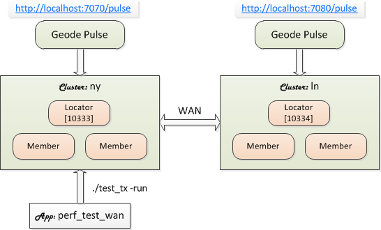

# Bundle: WAN

The `wan` bundle includes two (2) local clusters configured with bidirectional WAN gateways. You can test the bundle immediately after installation. No configurations required.

To understand how the clusters are configured, please see the following WAN example. It provides step-by-step instructions for creating and running WAN enabled clusters from scratch.

[Geode/GemFire WAN Example](https://github.com/padogrid/padogrid/wiki/Geode-WAN-Example)

## Installing Bundle

Install the bundle as a workspace by executing one of the following:

```bash
# To run
install_bundle -download -workspace bundle-geode-1-app-perf_test_wan-cluster-ln-ny

# # To run and/or check in
install_bundle -checkout bundle-geode-1-app-perf_test_wan-cluster-ln-ny
```

## Use Case

In this use case, two (2) local clusters are configured to replicate select  Geode/GemFire regions across the WAN. With the included `perf_test_wan` app you can ingest data into the `ny` cluster and monitor the WAN replication taking place into the `ln` cluster using Geode/GemFire Pulse in the browser.



## Startup Sequence

### 1. Switch Workspace

Switch into the bundle workspace to set the current workspace context.

```bash
switch_workspace bundle-geode-1-app-perf_test_wan-cluster-ln-ny
```

### 2. Start Clusters

Add a locator and two (2) members to both clusters. You can add more members if you have enough memory. Each member is configured with the maxiumu heap size of 1GB.

```bash
# ny
switch_cluster ny
add_locator; add_member; add_member

# ln
switch_cluster ln
add_locator; add_member; add_member
```

Run the clusters by executing one of the following options.

```bash
# Start both (all) clusters in the workspace
start_workspace

# You can also start clusters individually as follows
start_cluster -cluster ny
start_cluster -cluster ln
```

### 3. Monitor Clusters

The clusters can be monitored in a number of ways, i.e., by Pulse, gfsh, VSD, JMX, Grafana, geode-addon, etc. Let's use Pulse for our example. You can view the gateway sender activities from Pulse. To get the Pulse URLs for both clusters run the following:

```bash
# View all clusters in the workspace
show_cluster -all

# View clusters individually
show_cluster -long -cluster ny
show_cluster -long -cluster ln
```

You should see the following URLs from the command outputs.

- **ny:** [http://localhost:7070/pulse](http://localhost:7070/pulse)
- **ln:** [http://localhost:7080/pulse](http://localhost:7080/pulse)

:exclamation: Note that only one instance of Pulse can be viewed per browser. To view both clusters, you need to open two different browsers, e.g., view `ny` from Chrome and `ln` from Firefox.

## Test Cases

### Test Case 1. Parallel Gateway - Region `summary`

In this test case, we replicate data from the `ny` cluster to the `ln` cluster using **parallel** gatway senders. Both clusters have been configured with a parallel gateway named, `ny-to-ln-summary`. You can view the configuration file as follows.

```bash
cd_cluster ny
cat etc/cache.xml
```

Content of `cache.xml`:

```xml
  ...
	<!-- Parallel event queue for summary -->
	<gateway-sender id="ny-to-ln-summary" remote-distributed-system-id="2"
		parallel="true" dispatcher-threads="5" maximum-queue-memory="150">
	</gateway-sender>
  ...
```
      
There are three (3) regions configured to store co-located data: `eligibility`, `profile`, and `summary`. The `eligibility` and `profile` regions store member group benefit information. The `summary` region stores member group summary information which is aggregated by invoking [`EligFunction`](https://github.com/padogrid/padogrid/blob/develop/geode-addon-core/src/test/java/org/apache/geode/addon/test/perf/EligFunction.java) via `FunctionService.onRegion()`. `EligFunction` aggregates data from the co-located regions, `eligibility` and `profile`.

:pencil2: The included `perf_test_wan` app is the same `perf_test` app that you can also install by running the `create_app` command. There are no configuration differences between the two. Either one will properly populate data into both clusters.

The `perf_test_wan` app connects to the `ny` cluster so the `ny` cluster is the sender and `ln` is the receiver.

Change directory into the `perf_test_wan`'s `bin_sh` directory.

```bash
cd_app perf_test_wan; cd bin_sh
```

First, ingest data into the `eligibility` and `profile` regions. 

```bash
./test_ingestion -run
```

Next, generate transactional data into the `summary` region which is configured to replicate between the clusters. The following command invokes [`EligFunction`](https://github.com/padogrid/padogrid/blob/develop/geode-addon-core/src/test/java/org/apache/geode/addon/test/perf/EligFunction.java) for each member group ID.

```bash
./test_tx -run
```

You can monitor the Pulse instances to see the `summary` region being populated with [`GroupSummary`](https://github.com/padogrid/padogrid/blob/develop/geode-addon-core/src/test/java/org/apache/geode/addon/test/perf/data/GroupSummary.java) data.

### Replicating from `ln` to `ny`

If you want to send from the `ln` cluster to the `ny` cluster then change the locator port in the `client-cache.xml` file.

```bash
cd_app perf_test_wan
vi etc/client-cache.xml
```

Change the locator port number from 10333 (ny) to 10344 (ln).

```xml
<pool name="serverPool">
   <locator host="localhost" port="10344" />
</pool>
```

Run `test_tx` as before.

```bash
cd bin_sh
./test_tx -run
```

### Test Case 2. Parallel Gateway - Region `map1`

In this test case, we use another parallel gateway to replicate data from `ny` to `ln`. The `map` region has been configured with a parallel gateway named, `ny-to-ln-parallel`. Note that we cannot use the previous test case's `ny-to-ln-summary` gateway since in this test case, we have not co-located data.

```bash
cd_cluser nyc
cat etc/cache.xml
```

Content of `cache.xml`:

```xml
  ...
  <!-- Parallel event queue -->
	<gateway-sender id="ny-to-ln-parallel" remote-distributed-system-id="2"
		parallel="true" dispatcher-threads="5" maximum-queue-memory="150" order-policy="partition">
	</gateway-sender>
  ...
```

Execute the following to ingest data into the `map1` region.

```bash
cd_app perf_test_wan/bin_sh
./test_group -run -prop ../etc/group-map1.properties
```

Monitor the Pulse instances to view data getting replicated from `ny` to `ln`.

### Test Case 3. Serial Gateway - Region `map2`

A serial gateway sender funnels region events through a single Geode server in the local cluster to a gateway receiver in the remote Geode cluster. All other servers configured with the same gateway replicate the region events but do not send them to the gateway receiver. They remain standby until a failover occurs in which time one of them assumes the sender responsibility. For this reson, we should limit the number of gateway servers to a small number.

For our test case, only the first two (2) servers are preconfigured with a serial gateway. You can change the number of serial gateway servers by editing the `bin_sh/setenv.sh` file as follows.

```bash
# ny
cd_cluster ny/bin_sh
vi setenv.sh

# ln
cd_cluster ln/bin_sh
vi setenv.sh
```

Set `SERIAL_GATEWAY_SERVER_COUNT` in both cluster's `setenv.sh`:

```bash
SERIAL_GATEWAY_SERVER_COUNT=2
```

Both clusters have been configured with a serial gateway named, `ny-to-ln-serial`. You can view the configuration file as follows.

```bash
cd_cluster ny
cat etc/cache.xml
```

Content of `cache.xml`:

```xml
  ...
  <!-- Serial event queue -->
  <gateway-sender id="ny-to-ln-serial" remote-distributed-system-id="2"
		parallel="false" dispatcher-threads="5" maximum-queue-memory="150"
		order-policy="key">
	</gateway-sender>
  ...
```

The `map2` region has been configured with the `ny-to-ln-serial` gateway. You can use `perf_test` to ingest data in the `map2` region as follows.

```bash
cd_app perf_test_wan/bin_sh
./test_group -run -prop ../etc/group-map2.properties
```

Monitor the Pulse instances to view data getting replicated from `ny` to `ln`.

## Teardown

```bash
# Stop all custers in the workspace - '-all' removes both members and locators
stop_workspace -all
```

## References

1. Geode/GemFire WAN Example, https://github.com/padogrid/padogrid/wiki/Geode-WAN-Example
